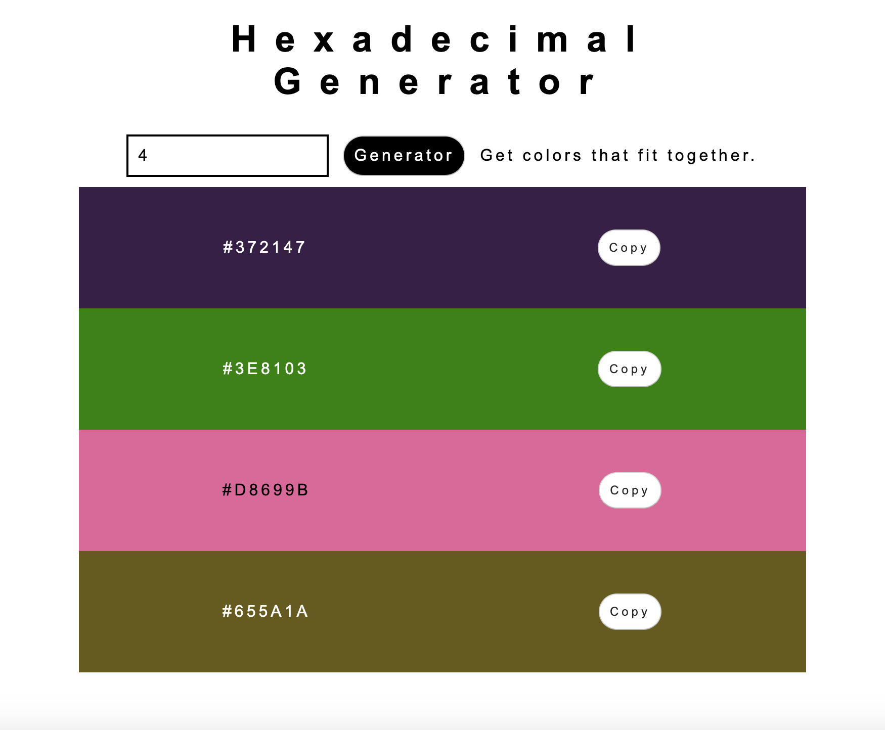

# Hexadecimal Color Generator

JavaScript App that generates a certain amount of random colors that fit together and can be copied to clipboard.

## Demo

[Hexadecimal color generator](http://htmlpreview.github.io/?https://github.com/johannarousi/Hexadecimal-Generator-JS-mini-project/blob/master/index.html)

## Technologies

- HTML
- CSS
- JavaScript

## Licence

MIT

## Author

Johanna Rousi

## Image

